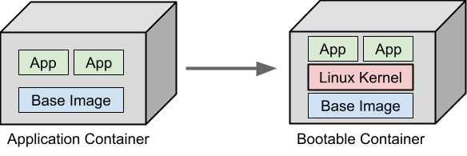
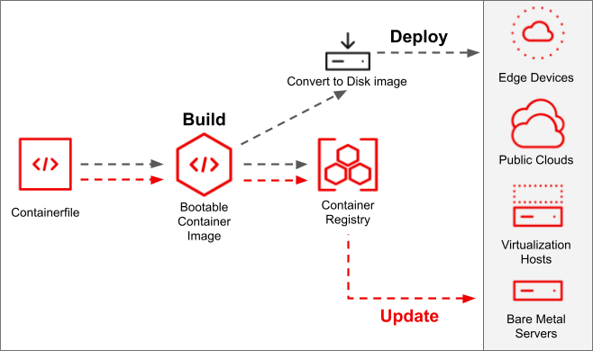

---
# **Hyprland Dev Setup con Universal Blue & CachyOS Kernel**

## **Introducción**
Universal Blue es un proyecto impresionante que redefine la experiencia en Linux, proporcionando distribuciones altamente optimizadas. Desde **Bluefin**, ideal para portátiles, hasta **Bazzite**, pensado para gaming, Universal Blue mantiene un enfoque en la calidad y facilidad de uso.

Este proyecto es una adaptación personalizada de **Fedora Atomic**, diseñada para satisfacer mis necesidades específicas, combinando alto rendimiento, herramientas de desarrollo avanzadas y una configuración automatizada y resiliente.

## **¿Qué es un Bootable Container?**
Un **bootable container** encapsula todo el sistema operativo, incluyendo el kernel de Linux, el cargador de arranque y los controladores, dentro de una imagen de contenedor. Esto permite que dicha imagen arranque y opere como un sistema completo.



## **Características principales**
### 🔹 **Kernel CachyOS con SCX Scheduler**

#### **Optimización del rendimiento**
- 🔧 **Compilación con Clang y ThinLTO** → Reduce tamaño de binarios y mejora la ejecución.
- 🚀 **AutoFDO y Propeller** → Optimización mediante perfiles para acelerar procesos críticos.
- ⚡ **Parcheo personalizado para AMD/Intel** → Ajustes específicos para arquitecturas modernas.

#### **Gestión avanzada de CPU**
- 🔄 **Planificadores personalizados** → EEVDF, BORE, BMQ, CacULE y más.
- 🏎 **AMD P-State Preferred Core** → Selección dinámica de núcleos óptimos en CPUs AMD.
- 📊 **Mejor balanceo de carga entre hilos de ejecución**.
- 🌍 **Mayor eficiencia energética en cargas mixtas**.

#### **Memoria y E/S optimizadas**
- 📀 **Algoritmos avanzados de caché y planificadores de E/S** → BFQ, Kyber, mq-deadline, etc.
- 🔥 **Reducción de latencias en operaciones de lectura/escritura**.
- 🎯 **Optimización en el uso de RAM para mayor fluidez**.

#### **Mejoras en seguridad**
- 🛡️ **Parcheo de vulnerabilidades** → Spectre, Meltdown, Retbleed.
- 🔑 **Optimizaciones criptográficas** → CRC32, AES128.
- 🚧 **Protección contra escalado de privilegios y exploits**.

#### **Otros ajustes**
- 🎧 **Optimización de IRQs** → Reducción de stuttering en audio/video.
- 📡 **Mejoras en el stack de redes** → Conexiones más rápidas y eficientes.
- 🔬 **Compatibilidad extendida con hardware moderno**.
- 🔋 **Controladores de energía optimizados** → Reducción de consumo en portátiles.

---

### 🔹 **Mejoras Universal Blue**
Este setup incorpora todas las ventajas de las distros **Universal Blue**, como:
- ⚙️ **Udev rules** preconfiguradas.
- 🔄 **Actualizaciones automáticas y autónomas**.
- 🎵 **PulseAudio optimizado**.
- 🎞 **Todos los códecs multimedia preinstalados**.
- 🛠 **Scripts Just para gestión avanzada**.

---

### 🔹 **Herramientas de desarrollo incluidas**
Este entorno está optimizado para **desarrollar** y **jugar**, integrando herramientas clave:
- 📝 **Visual Studio Code** y **Zed**.
- 📦 **Docker, Podman, Podman Compose y Distrobox** con interfaz gráfica **BoxBuddy**.
- 🚀 **DevPod** → Montaje rápido de devcontainers con un clic.
- 🔲 **Kitty** → Terminal moderna con **Fish** y plugins en Rust.
- 📜 **Gestor de paquetes Brew**.
- 🪟 **Hyprland** → Última versión desde Git como compositor Wayland.

---

### 🔹 **Gaming y compatibilidad con Windows**
Este setup también incluye soporte para **gaming** y software de **Windows** en Linux:
- 🎮 **Steam**, **Epic Games**, **GOG** preconfigurados.
- 📦 **PortProton** → Facilita la ejecución de software de Windows en entornos aislados.
- 🍷 **Bottles** → Gestión avanzada de dependencias y entornos Wine con un solo clic.
- 📌 **Compatibilidad con Proton y Lutris** → Optimización de juegos nativos y de Windows.

📢 También hay una versión con **drivers NVIDIA Open** de **Negativo17**, completamente automatizada y preconfigurada.

---

### 🔹 **Warp VPN y Virtualización avanzada**
Este setup también incorpora:
- 🔒 **Warp VPN** → Acceso rápido y seguro a una VPN con Cloudflare.
- 🖥 **Virt-Manager, Libvirt y KVM** → Soporte completo para la gestión de **máquinas virtuales**, permitiendo ejecutar sistemas completos con alto rendimiento.
- 🏗 **Compatibilidad con Incus** → Soporte para contenedores ligeros tipo LXD.

---

## **¿Cómo funciona el proceso?**


## **Instalación**
> ⚠️ **Nota:** Esta es una versión personalizada para mí, por lo que no hay ISOs públicas. El sistema se despliega automáticamente en mi ordenador.

Para convertir una instalación **Fedora Atomic** existente a esta versión:
```bash
# Primero cambia a la imagen no firmada para instalar claves y políticas de firma:
rpm-ostree rebase ostree-unverified-registry:ghcr.io/bogdandabeast/hyprland-nvidia-open:latest

# Reinicia el sistema:
systemctl reboot

# Luego cambia a la imagen firmada:
rpm-ostree rebase ostree-image-signed:docker://ghcr.io/bogdandabeast/devsetup-nvidia-open:latest

# Reinicia nuevamente:
systemctl reboot
```
La etiqueta `latest` automáticamente apuntará a la última versión.

---

## **Verificación**
Estas imágenes están firmadas con [Sigstore](https://www.sigstore.dev/) y [cosign](https://github.com/sigstore/cosign). Puedes verificar la firma ejecutando:
```bash
cosign verify --key cosign.pub ghcr.io/bogdandabeast/dev-setup
```

---

## **ISO**
*(Sección pendiente)*

---


